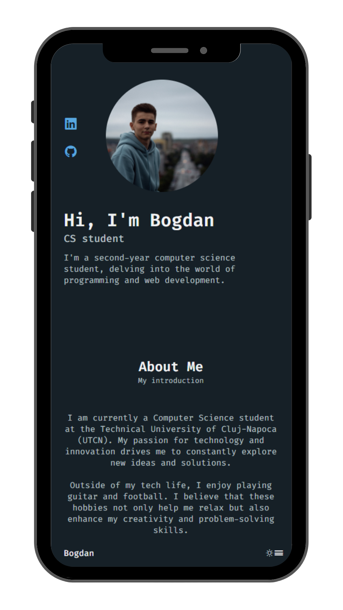
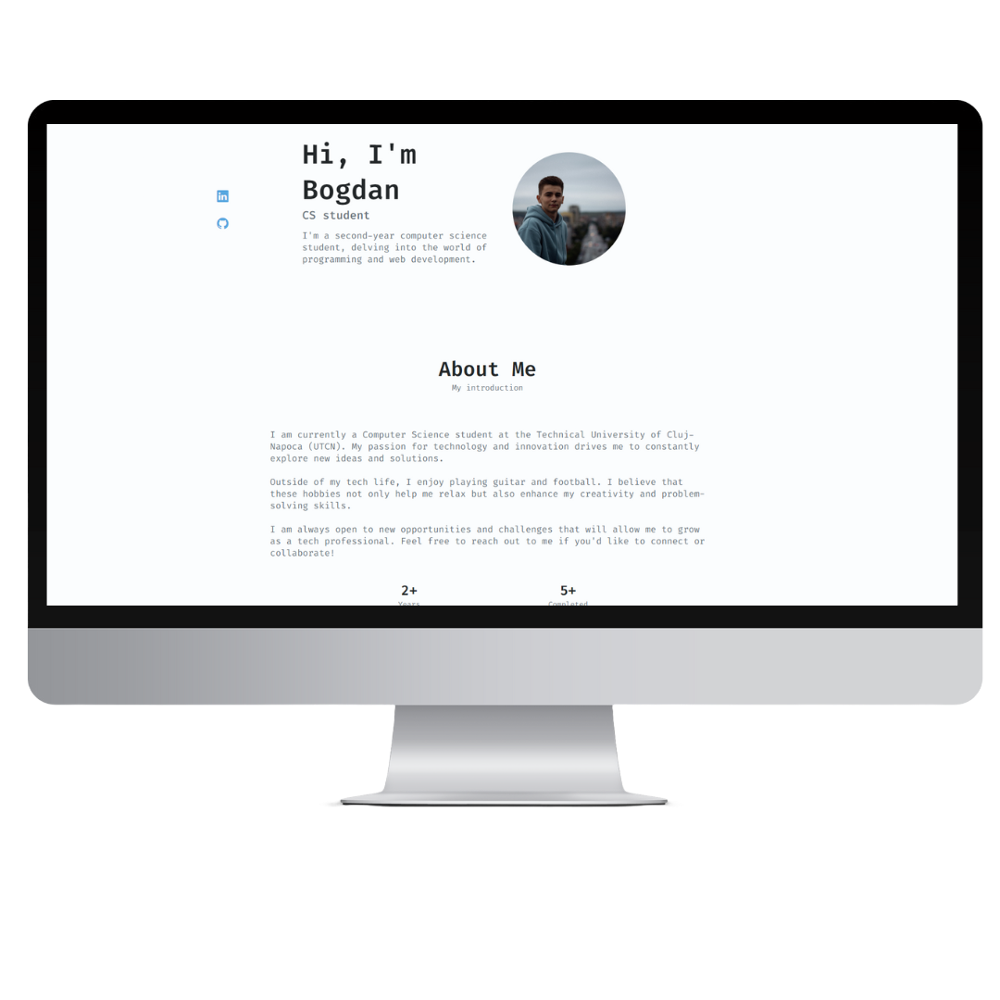

# Portfolio Website

Welcome to my responsive personal portfolio website! This project showcases my skills and projects using HTML, CSS, and JavaScript.

## Technologies Used

- HTML5
- CSS3
- JavaScript 

## Installation

No installation required for this static website. Simply open the [Live Demo](https://bogdan016.github.io/Portofolio-Website/) to explore.

## Usage

Explore my portfolio to learn more about my skills, projects, and experience. 

## Examples

### Mobile View 

### Desktop View

