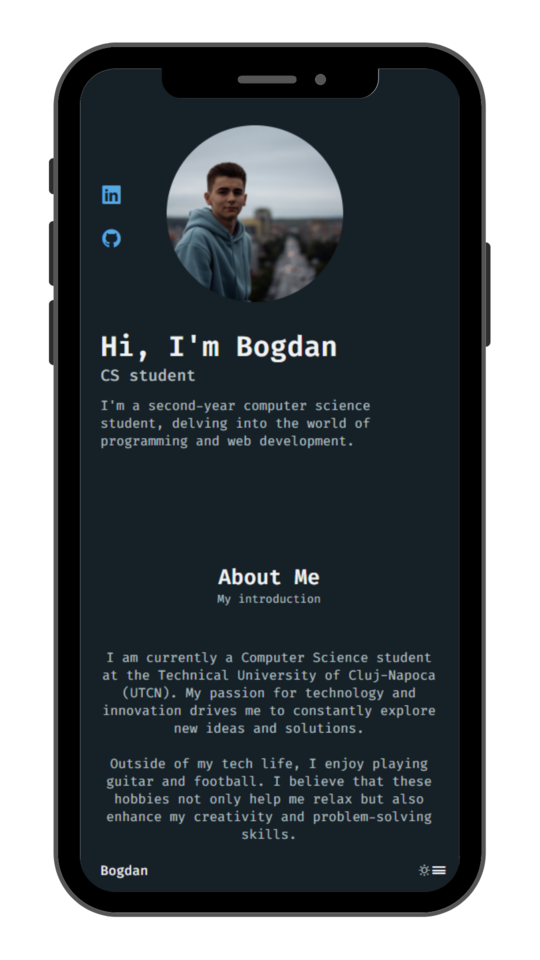
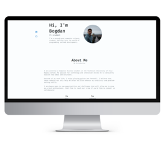

# Portfolio Website

Welcome to my responsive personal portfolio website! This project showcases my skills and projects using HTML, CSS, and JavaScript.

## Examples

### Mobile View (Iphone 14 Pro Max)

### Desktop View

## Features

- **Responsive Design:** The website is designed to be fully responsive, ensuring a seamless experience across various devices.
- **Dark/Light Mode:** Users can toggle between dark and light themes for comfortable browsing in different environments.

## Technologies Used

- HTML
- CSS
- JavaScript

## Usage

Explore my portfolio to learn more about my skills, projects, and experience. Toggle between Dark and Light mode for your preferred viewing experience.

## Contact

Feel free to reach out if you have any questions or just want to connect:

Enjoy exploring my portfolio!
